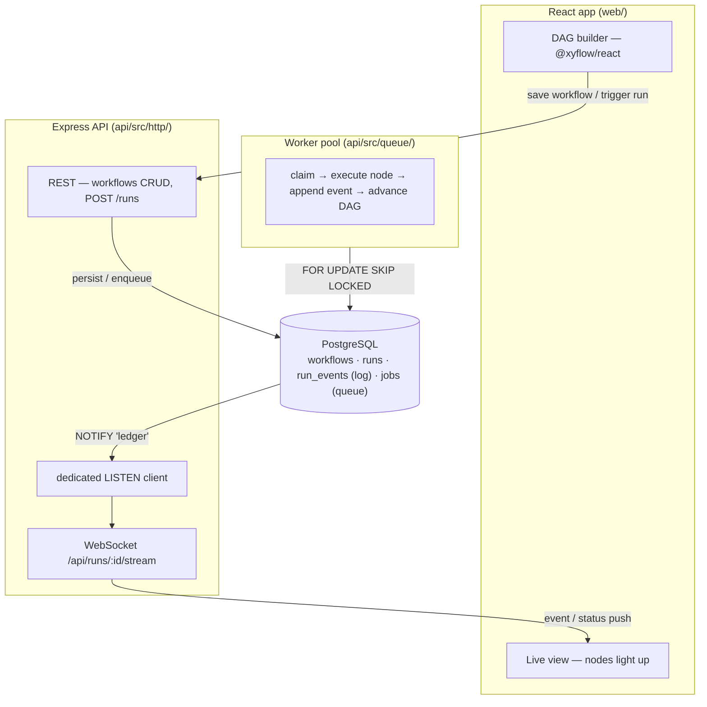

# Ledger

**A workflow automation engine where every execution step is a permanent, replayable event — so the system can always prove what actually happened, and always recover from where it stopped.**

Ledger is a visual workflow tool (think n8n / Zapier): you drag-connect nodes into a DAG — trigger → HTTP call → condition → delay — and run it. The difference from a typical clone is the assumption it's built on: **crashes are normal, and the system is designed around surviving them, not avoiding them.** Kill the server or a worker process mid-run, restart it, and the workflow resumes from the last completed step — no lost steps, no double-executed side effects.

Stack: **React** + **@xyflow/react** (builder) · **Node.js / Express** (API + workers) · **PostgreSQL** — the single source of truth. No Redis, no external queue. The whole point is proving durable execution on plain Postgres.

---

## Why this is hard

1. **Event-sourced execution.** There is no "current status" field that can silently drift from reality. Every step transition is an immutable, appended row in `run_events`. Current state is *derived* by reading events, never trusted from memory.
2. **Concurrency-safe job claiming.** Multiple worker processes poll one queue table; two workers must never grab the same job. Solved with `SELECT … FOR UPDATE SKIP LOCKED`, not an in-memory lock (which dies with the process). Proven: 5 real processes drain 500 jobs with **zero double-claims**.
3. **Crash-safe resumption.** A worker can die *mid-step*. On restart the system tells — purely from Postgres — whether a claimed-but-unfinished job actually completed, and safely re-runs only what didn't. Proven by an automated `kill -9` test.
4. **Live state without polling.** The canvas reflects the database's truth in real time over a WebSocket fed by Postgres `LISTEN/NOTIFY`.

---

## Architecture



Everything the API and workers agree on lives in Postgres. Workers are plain Node processes — run one or many; they coordinate only through the database.

### Schema (the whole coordination layer)

| Table | Role |
|-------|------|
| `workflows` | the DAG definition (`{ nodes, edges }` as JSONB) |
| `runs` | one row per execution; `status` is *derived* from the job projection |
| `run_events` | **append-only event log** — `step_started` / `step_completed` / `step_failed` / `retry`. The source of truth. |
| `jobs` | the queue workers poll — `queued` / `claimed` / `done` / `failed`, with `attempts` and `available_at` for backoff |

### The core trick — safe job claiming

```sql
UPDATE jobs
SET status = 'claimed', claimed_by = $1, claimed_at = now(), attempts = attempts + 1
WHERE id = (
  SELECT id FROM jobs
  WHERE status = 'queued' AND available_at <= now()
  ORDER BY id
  FOR UPDATE SKIP LOCKED
  LIMIT 1
)
RETURNING *;
```

`SKIP LOCKED` makes a row another worker is already locking invisible to this query — so two workers can never claim the same job, with zero application-level locking.

### How the pieces fit

- **DAG advancement is atomic with completion.** When a node completes, `advanceDag` enqueues its ready successors *inside the same transaction* as the `step_completed` event, under a per-run advisory lock — so a crash commits both or neither, and a fan-in join is enqueued exactly once (`UNIQUE (run_id, node_id)` + `ON CONFLICT`).
- **Crash recovery reads only the DB.** A sweep (on worker startup + periodically) requeues jobs `claimed` past a timeout with no matching `step_completed` event. Only the in-flight node re-runs; completed steps never do.
- **Live view.** Triggers `pg_notify` on every event insert and status change; a dedicated (non-pooled) `LISTEN` client relays them through a `ws` server to the browser. No polling.

---

## Quickstart

Requires **Node 20+** and **PostgreSQL 14+** running locally.

```bash
git clone https://github.com/manav363/Ledger.git && cd Ledger
createdb ledger_dev            # default DSN is postgres://localhost:5432/ledger_dev
npm install
npm run migrate                # create tables + triggers
```

Then, in three terminals (or background them):

```bash
npm run server                 # API + WebSocket on :3001
npm run worker                 # a worker that executes runs
npm run web                    # the builder on :5173
```

Open **http://localhost:5173**, drag out a few nodes, connect them, hit **Run**, and watch the canvas light up node-by-node.

> `DATABASE_URL` overrides the connection string; with a local `ledger_dev` database you need no env at all.

---

## The demo that makes the point

```bash
npm run demo:crash
```

Starts a run, spawns a worker, `kill -9`s it *mid-node*, then a second worker sweeps, reclaims the stranded step, and finishes the run. The printed event timeline shows the killed node with **two `step_started` and one `step_completed`** — it re-ran exactly once, and the already-completed steps were never touched.

---

## Tests

Stop any standalone worker first — a running worker steals the tests' jobs from the shared dev database.

```bash
npm test
```

| Suite | Proves |
|-------|--------|
| `loadtest:claiming` | 5 real processes drain 500 jobs → **0 double-claims** |
| `test:http` | HTTP node executes, captures output; transport failure retries then fails |
| `test:dag` | linear chain (+ input threading), fan-out, conditional branch, exactly-once fan-in |
| `test:crash` | `kill -9` mid-run: completed steps not re-run, killed step reruns exactly once |
| `test:live` | a WS client receives snapshot → per-node events → terminal status |

---

## Project structure

```
api/
  src/db/         pool + migration runner
  src/queue/      claim / complete / fail / recover, runJob, worker-entry, startRun
  src/dag/        edge conditions, advanceDag, graph helpers
  src/nodes/      pluggable node types (http, noop, sleep) + registry
  src/http/       Express routes, validation, ws server, live LISTEN client
db/migrations/    001 schema · 002 dag unique index · 003 notify triggers
web/
  src/components/ canvas node, palette, config panel, run log
  src/lib/        api client, run stream (WS), graph <-> definition
```

Adding a node type is one entry in `api/src/nodes/registry.ts` — the queue and event-sourcing core never change.

---

## Status

Built end to end: schema + concurrency-safe claiming → HTTP node execution → DAG execution (branch / fan-out / join) → crash recovery → React builder → live view. Known limitation: a join placed *after* a conditional branch won't fire (needs dead-path elimination).
