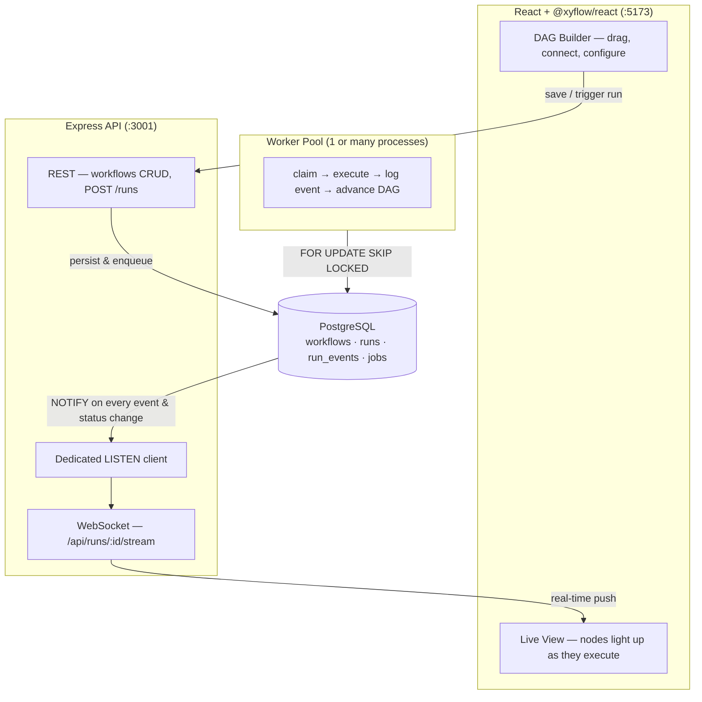

<div align="center">

# ▚ Ledger

**Kill the server mid-run. Restart it. The workflow picks up exactly where it stopped.**

A workflow automation engine built on a single assumption:<br/>
*Crashes are normal. The system is designed around surviving them, not avoiding them.*

<br/>

[](https://nodejs.org/)
[](https://www.postgresql.org/)
[](https://www.typescriptlang.org/)
[](https://react.dev/)

</div>

<br/>

## What is this?

Ledger is a visual workflow tool — you drag-connect nodes into a DAG (trigger → HTTP call → condition → delay), hit Run, and watch nodes light up in real time. Think n8n or Zapier, but the entire execution layer is **event-sourced** and **crash-safe**.

Every step transition is an immutable row in an append-only log. Current state is *derived*, never stored. Workers coordinate through `SELECT … FOR UPDATE SKIP LOCKED` — no Redis, no external queue, no in-memory locks. Just PostgreSQL.

**The result:** `kill -9` a worker mid-step, start a new one, and it resumes from the exact point of failure. Completed steps never re-run. The stranded step re-runs exactly once.

---

## Why this is hard to build

Most workflow engines treat crashes as edge cases. Ledger treats them as the default operating mode. Four problems had to be solved simultaneously:

| Problem | How Ledger solves it |
|---------|---------------------|
| **State drift** — a "status" column can silently disagree with what actually happened | No status column. State is *projected* from an append-only event log (`run_events`). What the log says happened, happened. |
| **Double-claiming** — two workers grab the same job from the queue | `SELECT … FOR UPDATE SKIP LOCKED` — a row another worker is locking becomes invisible. Zero application-level locking. Proven: 5 processes drain 500 jobs with **0 double-claims**. |
| **Crash mid-step** — a worker dies between "started" and "completed" | A periodic sweep requeues jobs `claimed` past a timeout *only if* no `step_completed` event exists. The in-flight step re-runs; finished steps never do. Proven with automated `kill -9`. |
| **Stale UI** — the browser doesn't know what the database knows | Postgres `LISTEN/NOTIFY` triggers fire on every event insert and status change. A dedicated (non-pooled) connection relays them over WebSocket. No polling. |

---

## Architecture

Three processes, one coordination layer:

```
┌─────────────────────────────────────────────────────────────────────┐
│                        PostgreSQL (the brain)                       │
│  workflows · runs · run_events (append-only log) · jobs (queue)    │
└──────────┬───────────────────┬──────────────────────┬───────────────┘
           │                   │                      │
    persist / enqueue    SKIP LOCKED claim     NOTIFY 'ledger'
           │                   │                      │
    ┌──────┴──────┐    ┌───────┴────────┐    ┌────────┴────────┐
    │  Express    │    │  Worker Pool   │    │  LISTEN client  │
    │  REST API   │    │  claim → exec  │    │  → WebSocket    │
    │  :3001      │    │  → log → DAG   │    │  → React live   │
    └──────┬──────┘    └────────────────┘    └────────┬────────┘
           │                                          │
    ┌──────┴──────────────────────────────────────────┴──────┐
    │              React + @xyflow/react (:5173)              │
    │         drag-connect nodes · configure · run · watch    │
    └─────────────────────────────────────────────────────────┘
```



Everything the API and workers agree on lives in Postgres. Workers are stateless Node processes — run one or twenty. They coordinate only through the database.

> **Deep dive:** see [`docs/system_architecture.md`](docs/system_architecture.md) for full endpoint mappings, sequence diagrams, DB schema ERD, and internal module documentation.

---

## The database is the system

Four tables. That's the entire coordination layer.

| Table | What it does |
|-------|-------------|
| `workflows` | The DAG definition — `{ nodes, edges }` as JSONB |
| `runs` | One row per execution. `status` is *derived* from the job projection, never manually set |
| `run_events` | **Append-only event log.** `step_started` / `step_completed` / `step_failed` / `retry`. This is the source of truth |
| `jobs` | The queue workers poll — `queued` → `claimed` → `done` or `failed`, with `attempts` and `available_at` for exponential backoff |

**The core trick — safe job claiming:**

```sql
UPDATE jobs
SET    status = 'claimed', claimed_by = $1, claimed_at = now(),
       attempts = attempts + 1
WHERE  id = (
  SELECT id FROM jobs
  WHERE  status = 'queued' AND available_at <= now()
  ORDER  BY id
  FOR UPDATE SKIP LOCKED      -- ← locked rows become invisible
  LIMIT  1
)
RETURNING *;
```

**Atomic DAG advancement:** when a node completes, `advanceDag` enqueues its ready successors *inside the same transaction* as the `step_completed` event, under a per-run advisory lock. A crash commits both or neither. A fan-in join is enqueued exactly once via `UNIQUE (run_id, node_id)` + `ON CONFLICT DO NOTHING`.

---

## Quickstart

**Prerequisites:** Node.js 20+ · PostgreSQL 14+ running locally

```bash
git clone https://github.com/manav363/Ledger.git && cd Ledger
createdb ledger_dev           # default DSN — or set DATABASE_URL
npm install
npm run migrate               # tables + indexes + NOTIFY triggers
```

Then start the three processes:

```bash
npm run server                # Express API + WebSocket on :3001
npm run worker                # worker that polls and executes
npm run web                   # React builder on :5173
```

Open **http://localhost:5173** → drag out some nodes → connect them → hit **Run** → watch the canvas light up node by node.

---

## The demo that proves it

```bash
npm run demo:crash
```

This script does exactly one thing: **proves crash recovery works.**

1. Creates a three-node workflow: `fetch` → `process` (4s sleep) → `notify`
2. Spawns `worker-1`, which picks up `fetch` (completes), then `process` (starts sleeping)
3. Sends `kill -9` to `worker-1` **mid-sleep**
4. Spawns `worker-2`, which sweeps for abandoned jobs, reclaims `process`, finishes the run

The printed event timeline shows:

```
fetch     step_started     worker-1
fetch     step_completed   worker-1      ← done, never touched again
process   step_started     worker-1      ← started by worker-1
process   step_started     worker-2      ← re-started after kill -9
process   step_completed   worker-2      ← completed exactly once
notify    step_started     worker-2
notify    step_completed   worker-2
── run status: completed ──
```

`process` shows `step_started` **twice** but `step_completed` **once**. `fetch` was never re-run.

---

## Tests

> Stop any standalone worker first — a running worker will steal jobs from the test harness.

```bash
npm test
```

| Suite | What it proves |
|-------|---------------|
| `loadtest:claiming` | 5 real OS processes drain 500 jobs → **0 double-claims** |
| `test:http` | HTTP node executes, captures response; transport failures retry then fail |
| `test:dag` | Linear chain, fan-out, conditional branch, exactly-once fan-in, input threading |
| `test:crash` | `kill -9` mid-run — completed steps untouched, killed step reruns exactly once |
| `test:live` | WebSocket client receives snapshot → per-node events → terminal status in order |

---

## API

All endpoints are prefixed with `/api`. The Vite dev server proxies them to `:3001`.

| Method | Endpoint | What it does |
|--------|----------|-------------|
| `GET` | `/api/health` | `{ ok: true }` |
| `GET` | `/api/node-types` | Returns `["http", "noop", "sleep"]` |
| `GET` | `/api/workflows` | List all workflows, newest first |
| `GET` | `/api/workflows/:id` | Get a workflow with its full definition |
| `POST` | `/api/workflows` | Create a workflow (validates the DAG definition) |
| `PUT` | `/api/workflows/:id` | Update a workflow |
| `POST` | `/api/runs` | Trigger a run — enqueues root nodes, returns `run_id` |
| `GET` | `/api/runs/:id` | Snapshot: status + per-node state + full event log |
| `WS` | `/api/runs/:id/stream` | Real-time stream — snapshot on connect, then live deltas |

Full request/response schemas are documented in [`docs/system_architecture.md`](docs/system_architecture.md).

---

## Node types

Adding a node type is **one entry** in `api/src/nodes/registry.ts`. The queue, event log, and DAG engine don't change.

| Type | What it does | Idempotent on re-run? |
|------|-------------|----------------------|
| `http` | Executes an HTTP request via `fetch()`. Captures status, headers, body. 4xx/5xx are results, not errors — only transport failures trigger retry. | ❌ A non-idempotent method (POST) can fire twice if the worker crashes after sending but before logging completion. |
| `noop` | Does nothing. Echoes `config.emit` as output. Used for testing and branching. | ✅ |
| `sleep` | Waits `config.ms` milliseconds. Gives the crash demo a window to kill the worker. | ✅ |

---

## Project structure

```
api/
  src/server.ts           entrypoint — HTTP + WebSocket + LISTEN
  src/db/                 pg pool + migration runner
  src/http/               Express app, REST routes, WS server, LISTEN relay
  src/queue/              claim, complete, fail, recover, worker loop, startRun
  src/dag/                graph helpers, advanceDag, edge condition evaluator
  src/nodes/              pluggable handlers (http, noop, sleep) + registry
db/migrations/            001 schema · 002 unique index · 003 NOTIFY triggers
web/
  src/App.tsx             main app — canvas + toolbar + panels
  src/components/         LedgerNode, Palette, ConfigPanel, RunLog
  src/lib/                API client, WS stream, graph ↔ definition converters
docs/
  system_architecture.md  full architecture deep-dive
```

---

## Tech stack

| Layer | Technology |
|-------|-----------|
| Frontend | React 18 · @xyflow/react · Vite · Vanilla CSS |
| API | Node.js · Express 4 · ws (WebSocket) |
| Database | PostgreSQL 14+ · node-postgres (`pg`) |
| Language | TypeScript 5.7 · tsx (runtime) |
| Coordination | Event sourcing · `FOR UPDATE SKIP LOCKED` · advisory locks · `LISTEN/NOTIFY` |

No Redis. No RabbitMQ. No external queue. The whole point is proving durable execution on plain Postgres.

---

## Known limitations

- **No dead-path elimination.** A join node after a conditional branch where one arm is skipped will never fire — the skipped parent never completes. Fixing this requires propagating "skipped" tokens.
- **HTTP node is at-least-once.** A crash between sending a request and logging `step_completed` can cause a duplicate POST. An idempotency-key option is the planned fix.
- **No authentication.** All endpoints are open.

---

## License

[MIT](LICENSE)
