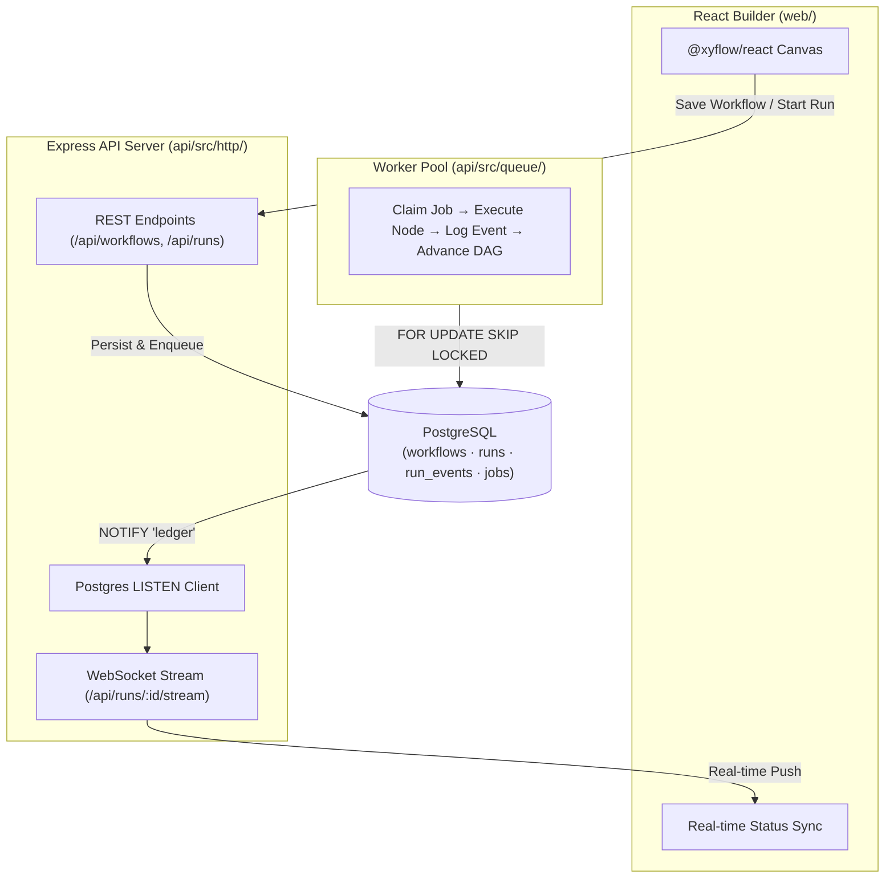

# Ledger

> A high-performance, durable workflow automation engine where every execution step is an immutable, replayable event — built for guaranteed recovery, fault tolerance, and zero-state drift.

[](https://nodejs.org/)
[](https://www.postgresql.org/)
[](https://react.dev/)
[](https://www.typescriptlang.org/)
[](LICENSE)

---

## 📌 Overview

**Ledger** is a visual, DAG-based workflow automation engine (similar to n8n or Zapier) designed with a core principle: **crashes are normal, and systems must be designed around surviving them.**

If a server or worker process crashes mid-execution, Ledger leverages event-sourcing and database-backed state machine mechanics to ensure workflows seamlessly resume from the last completed step — with **zero lost execution steps** and **zero duplicated side effects**.

Unlike conventional platforms that rely on Redis or complex external message queues, Ledger uses **PostgreSQL as the sole source of truth and coordination layer**.

---

## ✨ Key Features

- **📜 Event-Sourced Execution**: Execution status is derived dynamically by projecting an immutable, append-only event log (`run_events`), preventing state drift.
- **🔒 Concurrency-Safe Job Claiming**: Worker pools claim jobs safely using `SELECT ... FOR UPDATE SKIP LOCKED`, preventing double-claiming across distributed processes without application-level locking.
- **💥 Crash-Resilient Resumption**: Automated crash detection requeues uncompleted jobs while preserving already finished step state. Verified with automated `kill -9` integration tests.
- **⚡ Real-Time Visualization**: WebSocket-backed UI updating in real-time via PostgreSQL `LISTEN / NOTIFY` events — eliminating HTTP polling overhead.
- **🔌 Pluggable Node Architecture**: Extendable node execution registry (`HTTP`, `Sleep`, `No-op`). Adding custom logic takes just a single entry.
- **🔀 Advanced DAG Control**: Supports linear chaining, fan-out parallel execution, conditional edge evaluation, and fan-in joining.

---

## 🏗 System Architecture



> 📖 **Detailed Architecture Documentation**: For an in-depth deep dive into the system design, core execution loops, DB schemas, sequence diagrams, and endpoint mappings, inspect [docs/system_architecture.md](file:///Users/manavgarg/Desktop/PROJECTS/Ledger/docs/system_architecture.md).

---

## 🛠 Tech Stack

- **Frontend**: React 18, `@xyflow/react`, Vite, Vanilla CSS
- **Backend**: Node.js, Express, `ws` (WebSockets), TypeScript (`tsx`)
- **Database**: PostgreSQL 14+ (`pg` client)
- **Architecture Pattern**: Event Sourcing, Database Queueing, Advisory Locks

---

## 🚀 Quickstart

### Prerequisites

- **Node.js** v20+
- **PostgreSQL** v14+ running locally

### Installation

1. **Clone the repository & install dependencies**:
   ```bash
   git clone https://github.com/manav363/Ledger.git
   cd Ledger
   npm install
   ```

2. **Setup the Database**:
   Create a database (default connection string `postgres://localhost:5432/ledger_dev` or override with `DATABASE_URL`):
   ```bash
   createdb ledger_dev
   npm run migrate
   ```

3. **Start the Application**:
   Launch the API server, worker process, and web interface in separate terminals (or run concurrently):
   ```bash
   # Terminal 1: Start Express API & WebSocket Server (:3001)
   npm run server

   # Terminal 2: Start Worker Process
   npm run worker

   # Terminal 3: Start Vite Web App (:5173)
   npm run web
   ```

4. **Access the Visual Builder**:
   Open [http://localhost:5173](http://localhost:5173) in your browser.

---

## 💥 Crash Recovery Demo

Ledger includes an automated test script demonstrating crash recovery under `kill -9` conditions:

```bash
npm run demo:crash
```

**What this does**:
1. Starts a workflow execution (`fetch` → `process [sleep 4s]` → `notify`).
2. Spawns `worker-1` which claims the `process` step.
3. Sends `kill -9` to `worker-1` **mid-step**.
4. Spawns `worker-2` which automatically detects the abandoned step, re-claims it, and finishes the run.
5. Displays the event log showing `step_started` **twice** for `process` but `step_completed` **once**, while `fetch` was never re-executed.

---

## 🧪 Testing

> ⚠️ **Note**: Ensure no standalone background worker processes are running before executing unit and integration tests to avoid job competition.

Run the test suite:
```bash
npm test
```

### Test Suite Summary

| Command | Focus / Proof |
| :--- | :--- |
| `npm run loadtest:claiming` | **Concurrency**: 5 parallel worker processes drain 500 jobs with **0 double-claims**. |
| `npm run test:http` | **Node Execution**: Validates HTTP node output capture and retry handling. |
| `npm run test:dag` | **Graph Execution**: Tests linear chains, fan-out, conditional branching, and fan-in. |
| `npm run test:crash` | **Crash Recovery**: Verifies `kill -9` mid-run recovery without step duplication. |
| `npm run test:live` | **Real-time Sync**: Ensures WebSocket stream receives initial snapshot and live deltas. |

---

## 📑 API Reference Summary

| Method | Endpoint | Description |
| :--- | :--- | :--- |
| `GET` | `/api/health` | Health check endpoint |
| `GET` | `/api/node-types` | List registered node execution types |
| `GET` | `/api/workflows` | List saved workflow definitions |
| `GET` | `/api/workflows/:id` | Get specific workflow definition |
| `POST` | `/api/workflows` | Create a new workflow definition |
| `PUT` | `/api/workflows/:id` | Update an existing workflow definition |
| `POST` | `/api/runs` | Trigger execution of a workflow |
| `GET` | `/api/runs/:id` | Get snapshot state and logs for a run |
| `WS` | `/api/runs/:id/stream` | Real-time WebSocket event stream |

For full endpoint schemas and payload details, refer to [docs/system_architecture.md](file:///Users/manavgarg/Desktop/PROJECTS/Ledger/docs/system_architecture.md).

---

## 📂 Directory Structure

```
Ledger/
├── api/                   # Backend Application
│   ├── src/db/            # Pool connection & migration runner
│   ├── src/http/          # Express app, REST routes, WebSocket server & LISTEN client
│   ├── src/queue/         # Job claiming, worker loop, crash recovery & execution
│   ├── src/dag/           # Graph traversal, edge evaluation & DAG advancement
│   └── src/nodes/         # Pluggable node handlers (HTTP, Sleep, No-op)
├── db/migrations/         # SQL Migrations (schema, indexes, notify triggers)
├── docs/                  # In-depth System Architecture documentation
└── web/                   # Frontend Application (React + @xyflow/react)
    ├── src/components/    # React Flow canvas, Palette, Config Panel, Run Log
    └── src/lib/           # API client, WebSocket stream client, graph utilities
```

---

## 📄 License

This project is licensed under the [MIT License](LICENSE).

