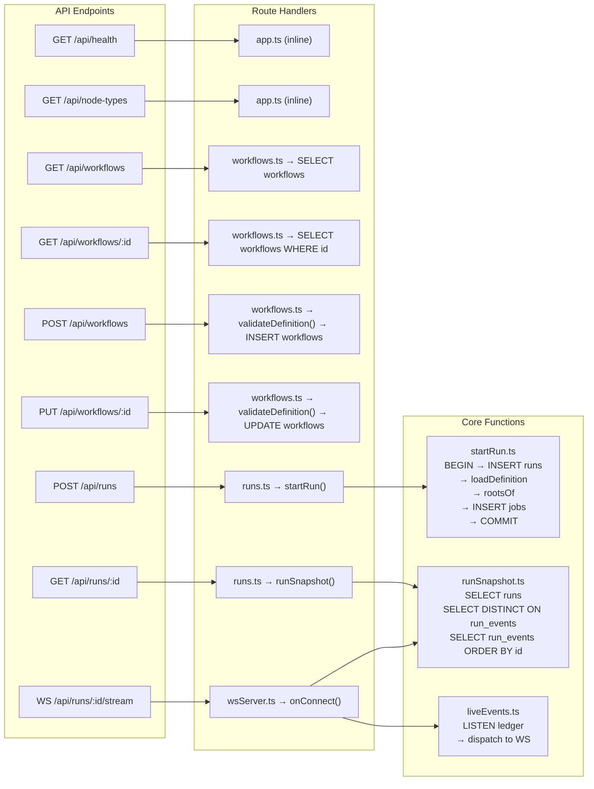
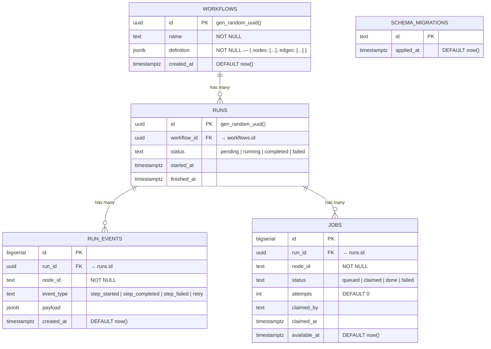
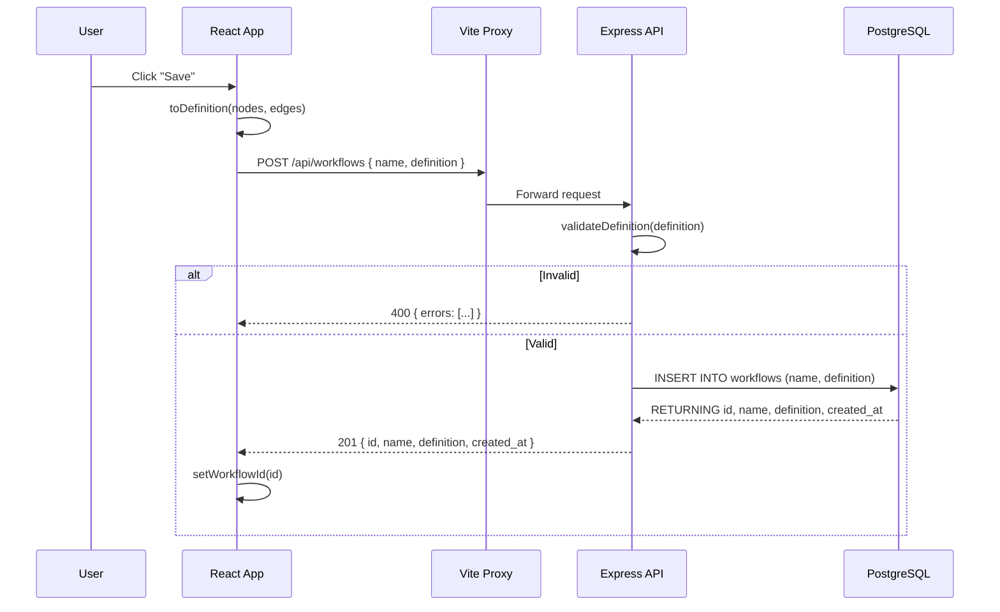
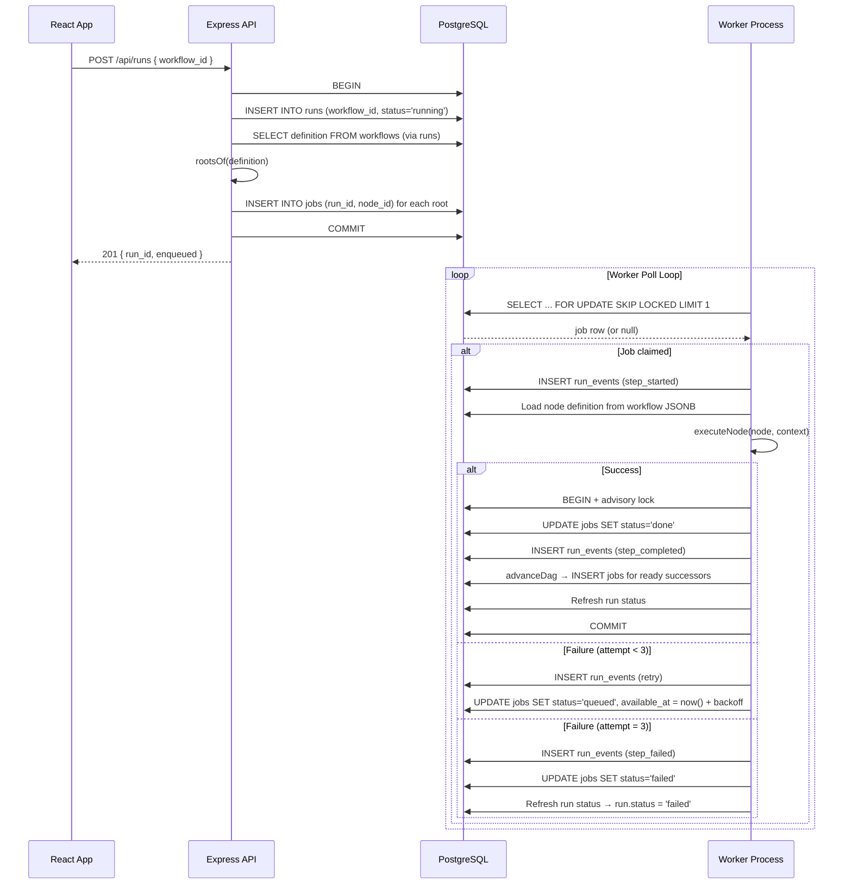
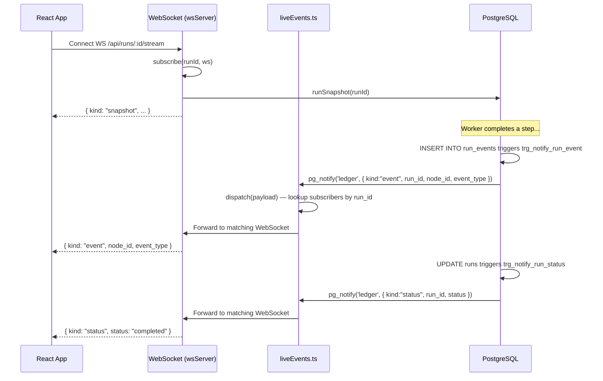
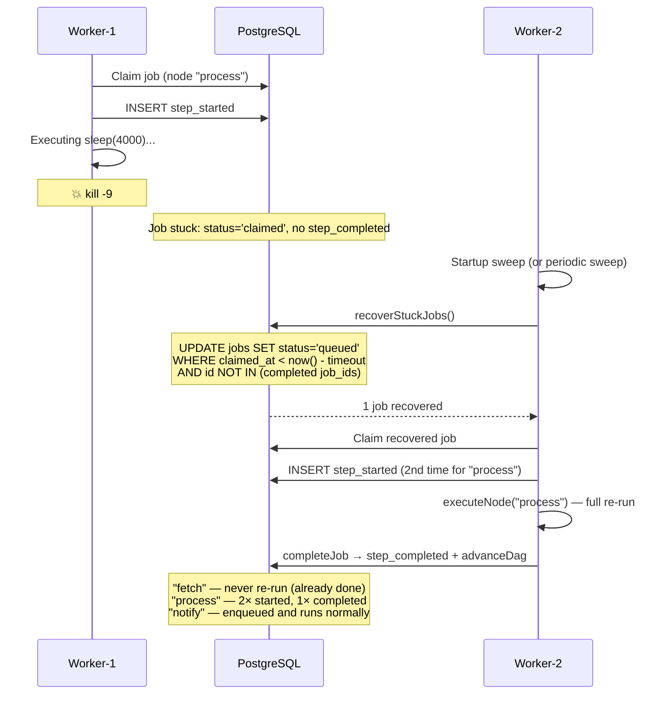

# Ledger — System Architecture

> A durable, crash-safe workflow automation engine built on event-sourcing and PostgreSQL as the single coordination layer.

---

## Table of Contents

- [High-Level Overview](#high-level-overview)
- [System Architecture Diagram](#system-architecture-diagram)
- [Technology Stack](#technology-stack)
- [Project Structure](#project-structure)
- [API Endpoints](#api-endpoints)
  - [REST Endpoints](#rest-endpoints)
  - [WebSocket Endpoint](#websocket-endpoint)
- [Endpoint → Handler Mapping](#endpoint--handler-mapping)
- [Database Schema](#database-schema)
- [Core Modules](#core-modules)
  - [HTTP Layer (`api/src/http/`)](#http-layer-apisrchttp)
  - [Queue / Worker Layer (`api/src/queue/`)](#queue--worker-layer-apisrcqueue)
  - [DAG Engine (`api/src/dag/`)](#dag-engine-apisrcdag)
  - [Node Executors (`api/src/nodes/`)](#node-executors-apisrcnodes)
  - [Database Layer (`api/src/db/`)](#database-layer-apisrcdb)
- [Frontend Architecture (`web/`)](#frontend-architecture-web)
- [Data Flow Diagrams](#data-flow-diagrams)
  - [Workflow Save Flow](#workflow-save-flow)
  - [Run Execution Flow](#run-execution-flow)
  - [Live Event Streaming Flow](#live-event-streaming-flow)
  - [Crash Recovery Flow](#crash-recovery-flow)
- [Concurrency & Safety Mechanisms](#concurrency--safety-mechanisms)
- [Known Limitations](#known-limitations)

---

## High-Level Overview

Ledger is a **three-process** system:

| Process | Command | Port | Role |
|---------|---------|------|------|
| **API Server** | `npm run server` | `:3001` | Express REST API + WebSocket live stream + Postgres LISTEN relay |
| **Worker** | `npm run worker` | — | Polls `jobs` table, executes nodes, advances DAG, recovers crashed jobs |
| **Web Frontend** | `npm run web` | `:5173` | React + @xyflow/react DAG builder, proxies `/api` → `:3001` via Vite |

All three processes coordinate **exclusively through PostgreSQL** — no Redis, no message broker, no in-memory shared state.

---

## System Architecture Diagram

```mermaid
flowchart TB
    subgraph Browser["Browser (:5173)"]
        ReactApp["React App<br/>@xyflow/react Canvas"]
        WSClient["WebSocket Client<br/>runStream.ts"]
        APIClient["HTTP Client<br/>api.ts"]
    end

    subgraph ViteDev["Vite Dev Server (:5173)"]
        Proxy["/api → :3001 proxy<br/>(HTTP + WS)"]
    end

    subgraph API["Express API Server (:3001)"]
        direction TB
        AppEntry["server.ts<br/>http.createServer + attachWs + startLiveEvents"]
        ExpressApp["app.ts<br/>Express App"]
        WFRoutes["workflows.ts<br/>Router /api/workflows"]
        RunRoutes["runs.ts<br/>Router /api/runs"]
        WSServer["wsServer.ts<br/>WebSocket /api/runs/:id/stream"]
        LiveEvents["liveEvents.ts<br/>Dedicated LISTEN client"]
        Snapshot["runSnapshot.ts<br/>Current run state builder"]
        Validate["validate.ts<br/>Definition validator"]

        AppEntry --> ExpressApp
        ExpressApp --> WFRoutes
        ExpressApp --> RunRoutes
        AppEntry --> WSServer
        AppEntry --> LiveEvents
        WSServer --> Snapshot
        RunRoutes --> Snapshot
        WFRoutes --> Validate
    end

    subgraph Worker["Worker Process(es)"]
        direction TB
        WorkerEntry["worker-entry.ts<br/>Poll loop + sweep timer"]
        ClaimJob["claimJob.ts<br/>SELECT ... FOR UPDATE SKIP LOCKED"]
        RunJob["runJob.ts<br/>step_started → execute → complete/fail"]
        CompleteJob["completeJob.ts<br/>done + step_completed + advanceDag"]
        FailJob["failJob.ts<br/>retry / step_failed + backoff"]
        Recover["recoverStuckJobs.ts<br/>Requeue abandoned jobs"]
        StartRun["startRun.ts<br/>Create run + enqueue roots"]
        LoadNode["loadNode.ts<br/>Resolve node definition from workflow"]
        RunStatus["runStatus.ts<br/>Derive & update run status"]

        WorkerEntry --> ClaimJob
        WorkerEntry --> RunJob
        WorkerEntry --> Recover
        RunJob --> CompleteJob
        RunJob --> FailJob
        CompleteJob --> RunStatus
        FailJob --> RunStatus
    end

    subgraph DAG["DAG Engine"]
        Advance["advance.ts<br/>Enqueue ready successors"]
        Condition["condition.ts<br/>Evaluate edge conditions"]
        Graph["graph.ts<br/>loadDefinition, rootsOf, gatherInputs"]
        Types["types.ts<br/>WorkflowDefinition, Edge, EdgeCondition"]

        Advance --> Condition
        Advance --> Graph
    end

    subgraph Nodes["Node Executors"]
        Registry["registry.ts<br/>Type → handler dispatch"]
        HTTPNode["http.ts<br/>fetch() wrapper"]
        NoopNode["noop.ts<br/>Pass-through / test node"]
        SleepNode["sleep.ts<br/>setTimeout delay"]

        Registry --> HTTPNode
        Registry --> NoopNode
        Registry --> SleepNode
    end

    subgraph PG["PostgreSQL"]
        TblWorkflows[("workflows<br/>DAG definitions (JSONB)")]
        TblRuns[("runs<br/>Execution instances")]
        TblEvents[("run_events<br/>Append-only event log")]
        TblJobs[("jobs<br/>Worker queue table")]
        Triggers["NOTIFY triggers<br/>trg_notify_run_event<br/>trg_notify_run_status"]
    end

    ReactApp --> APIClient
    ReactApp --> WSClient
    APIClient --> Proxy
    WSClient --> Proxy
    Proxy --> ExpressApp
    Proxy --> WSServer

    RunRoutes -->|"startRun()"| StartRun
    StartRun --> Graph
    RunJob --> LoadNode
    RunJob --> Graph
    RunJob --> Registry
    CompleteJob --> Advance

    WFRoutes --> TblWorkflows
    RunRoutes --> TblRuns
    StartRun --> TblRuns
    StartRun --> TblJobs
    ClaimJob --> TblJobs
    CompleteJob --> TblJobs
    CompleteJob --> TblEvents
    FailJob --> TblJobs
    FailJob --> TblEvents
    RunJob --> TblEvents
    Advance --> TblJobs
    Recover --> TblJobs
    RunStatus --> TblRuns
    Snapshot --> TblRuns
    Snapshot --> TblEvents

    Triggers -->|"pg_notify('ledger', ...)"| LiveEvents
    LiveEvents -->|"dispatch to subscribers"| WSServer
    WSServer -->|"JSON frames"| WSClient
```



---

## Technology Stack

| Layer | Technology | Version |
|-------|-----------|---------|
| Frontend | React | ^18.3.1 |
| Canvas / DAG Builder | @xyflow/react | ^12.11.3 |
| Frontend Build | Vite | ^6.0.3 |
| API Framework | Express | ^4.22.2 |
| WebSocket | ws | ^8.21.3 |
| Database Driver | pg (node-postgres) | ^8.13.1 |
| Database | PostgreSQL | 14+ |
| Runtime | Node.js | 20+ |
| TypeScript Runner | tsx | ^4.19.2 |
| Language | TypeScript | ^5.7.2 |
| Package Manager | npm workspaces | — |

---

## Project Structure

```
Ledger/
├── package.json                    # Root — npm workspaces (api, web)
├── api/                            # Backend workspace
│   ├── package.json
│   ├── tsconfig.json
│   └── src/
│       ├── server.ts               # Entrypoint: HTTP + WS + LISTEN
│       ├── db/
│       │   ├── pool.ts             # pg.Pool singleton
│       │   └── migrate.ts          # Sequential SQL migration runner
│       ├── http/
│       │   ├── app.ts              # Express app factory (routes + error handler)
│       │   ├── workflows.ts        # /api/workflows CRUD router
│       │   ├── runs.ts             # /api/runs router (trigger + status)
│       │   ├── wsServer.ts         # WebSocket /api/runs/:id/stream
│       │   ├── liveEvents.ts       # Dedicated pg LISTEN client + subscriber map
│       │   ├── runSnapshot.ts      # Build current run state from DB
│       │   ├── validate.ts         # Workflow definition validation
│       │   └── wrap.ts             # Async error wrapper for Express 4
│       ├── queue/
│       │   ├── worker-entry.ts     # Worker process entrypoint (poll loop)
│       │   ├── claimJob.ts         # Atomic job claim (SKIP LOCKED)
│       │   ├── runJob.ts           # Full job lifecycle (started → execute → complete/fail)
│       │   ├── completeJob.ts      # Mark done + step_completed + advanceDag (atomic)
│       │   ├── failJob.ts          # Retry with backoff or permanent failure
│       │   ├── enqueueJob.ts       # Simple INSERT INTO jobs
│       │   ├── startRun.ts         # Create run row + enqueue root nodes
│       │   ├── runStatus.ts        # Derive runs.status from job projection
│       │   ├── recoverStuckJobs.ts # Requeue timed-out claimed jobs
│       │   ├── loadNode.ts         # Resolve node_id → definition from workflow JSONB
│       │   └── crashDemo.ts        # Automated kill -9 crash-recovery demo
│       ├── dag/
│       │   ├── types.ts            # WorkflowDefinition, Edge, EdgeCondition types
│       │   ├── graph.ts            # Graph helpers (rootsOf, parentsOf, loadDefinition, gatherInputs)
│       │   ├── advance.ts          # advanceDag: enqueue ready successors
│       │   └── condition.ts        # Edge condition evaluator (eq, ne, lt, gt, truthy, etc.)
│       └── nodes/
│           ├── types.ts            # NodeDefinition, NodeContext, NodeHandler types
│           ├── registry.ts         # Handler dispatch table + executeNode()
│           ├── http.ts             # HTTP request node (fetch wrapper)
│           ├── noop.ts             # No-op / pass-through node
│           └── sleep.ts            # Delay node (setTimeout)
├── db/
│   └── migrations/
│       ├── 001_init.sql            # Core schema: workflows, runs, run_events, jobs
│       ├── 002_dag.sql             # UNIQUE index on jobs(run_id, node_id) for idempotent enqueue
│       └── 003_notify.sql          # LISTEN/NOTIFY triggers for live view
└── web/                            # Frontend workspace
    ├── package.json
    ├── vite.config.ts              # Proxy /api → :3001 (HTTP + WS)
    ├── index.html
    └── src/
        ├── main.tsx                # React root mount
        ├── App.tsx                 # Main app: canvas + toolbar + panels
        ├── styles.css              # All application styles
        ├── components/
        │   ├── LedgerNode.tsx      # Custom @xyflow node (type + status color)
        │   ├── Palette.tsx         # Node type palette (sidebar)
        │   ├── ConfigPanel.tsx     # Node config + edge condition forms
        │   └── RunLog.tsx          # Live event log feed
        └── lib/
            ├── api.ts              # Typed fetch helpers for REST endpoints
            ├── runStream.ts        # WebSocket client for live run events
            ├── graph.ts            # ReactFlow ↔ API definition converters
            └── nodeSpecs.ts        # Frontend node type metadata (labels, fields, colors)
```

---

## API Endpoints

### REST Endpoints

| Method | Path | Handler File | Handler Function | Description |
|--------|------|-------------|-----------------|-------------|
| `GET` | `/api/health` | `http/app.ts` | Inline | Health check — returns `{ ok: true }` |
| `GET` | `/api/node-types` | `http/app.ts` | Inline | List registered node types — returns `["http", "noop", "sleep"]` |
| `GET` | `/api/workflows` | `http/workflows.ts` | `workflows.get("/")` | List all workflows (newest first) |
| `GET` | `/api/workflows/:id` | `http/workflows.ts` | `workflows.get("/:id")` | Get a single workflow by UUID |
| `POST` | `/api/workflows` | `http/workflows.ts` | `workflows.post("/")` | Create a new workflow (validates definition) |
| `PUT` | `/api/workflows/:id` | `http/workflows.ts` | `workflows.put("/:id")` | Update an existing workflow |
| `POST` | `/api/runs` | `http/runs.ts` | `runs.post("/")` | Trigger a run of a workflow (enqueues root jobs) |
| `GET` | `/api/runs/:id` | `http/runs.ts` | `runs.get("/:id")` | Get run snapshot (status + node states + event log) |

### WebSocket Endpoint

| Protocol | Path | Handler File | Description |
|----------|------|-------------|-------------|
| `WS` | `/api/runs/:id/stream` | `http/wsServer.ts` | Live run stream — snapshot on connect, then real-time event/status deltas |

---

## Endpoint → Handler Mapping

The following diagram traces each endpoint from the Express router through to its database interactions:



### Detailed Endpoint Breakdown

#### `GET /api/health`
- **File:** `api/src/http/app.ts` (line 11)
- **Auth:** None
- **Response:** `200 { ok: true }`

#### `GET /api/node-types`
- **File:** `api/src/http/app.ts` (line 12)
- **Auth:** None
- **Response:** `200 ["http", "noop", "sleep"]`
- **Source:** `nodes/registry.ts` → `Object.keys(handlers)`

#### `GET /api/workflows`
- **File:** `api/src/http/workflows.ts` (lines 9–14)
- **Auth:** None
- **Query:** `SELECT id, name, created_at FROM workflows ORDER BY created_at DESC`
- **Response:** `200 [{ id, name, created_at }, ...]`

#### `GET /api/workflows/:id`
- **File:** `api/src/http/workflows.ts` (lines 16–20)
- **Auth:** None
- **Query:** `SELECT id, name, definition, created_at FROM workflows WHERE id = $1`
- **Response:** `200 { id, name, definition, created_at }` or `404 { error }`

#### `POST /api/workflows`
- **File:** `api/src/http/workflows.ts` (lines 22–31)
- **Auth:** None
- **Validation:** `validateDefinition(req.body.definition)` — checks nodes (unique ids, valid types) and edges (valid from/to refs)
- **Query:** `INSERT INTO workflows (name, definition) VALUES ($1, $2) RETURNING *`
- **Request body:** `{ name?: string, definition: { nodes: [...], edges: [...] } }`
- **Response:** `201 { id, name, definition, created_at }` or `400 { errors: [...] }`

#### `PUT /api/workflows/:id`
- **File:** `api/src/http/workflows.ts` (lines 33–43)
- **Auth:** None
- **Validation:** `validateDefinition(req.body.definition)`
- **Query:** `UPDATE workflows SET name = $2, definition = $3 WHERE id = $1 RETURNING *`
- **Request body:** `{ name?: string, definition: { nodes: [...], edges: [...] } }`
- **Response:** `200 { id, name, definition, created_at }` or `400 { errors }` / `404 { error }`

#### `POST /api/runs`
- **File:** `api/src/http/runs.ts` (lines 13–22)
- **Auth:** None
- **Validation:** `workflow_id` must be a valid UUID; workflow must exist
- **Calls:** `startRun(workflowId)` → atomically creates run + enqueues root nodes
- **Request body:** `{ workflow_id: "uuid" }`
- **Response:** `201 { run_id, enqueued: ["node-id", ...] }` or `400/404 { error }`

#### `GET /api/runs/:id`
- **File:** `api/src/http/runs.ts` (lines 26–31)
- **Auth:** None
- **Calls:** `runSnapshot(runId)`
- **Response:** `200 { id, status, started_at, finished_at, node_states: { nodeId: eventType }, events: [...] }` or `404 { error }`

#### `WS /api/runs/:id/stream`
- **File:** `api/src/http/wsServer.ts` (lines 6–21)
- **URL Pattern:** `/api/runs/[uuid]/stream`
- **On Connect:** Sends a `snapshot` frame with the current run state
- **Live Frames:** `event` (per-node step transitions) and `status` (run status changes) relayed from Postgres NOTIFY
- **Frame Types:**
  ```json
  { "kind": "snapshot", "run_id": "...", "status": "...", "node_states": {}, "events": [] }
  { "kind": "event", "run_id": "...", "node_id": "...", "event_type": "step_started|step_completed|step_failed|retry" }
  { "kind": "status", "run_id": "...", "status": "running|completed|failed" }
  ```

---

## Database Schema

### Entity Relationship Diagram



### Tables

| Table | Role | Key Columns |
|-------|------|-------------|
| `workflows` | DAG definitions | `id`, `name`, `definition` (JSONB with `{ nodes, edges }`) |
| `runs` | One row per execution | `id`, `workflow_id` (FK), `status` (derived), `started_at`, `finished_at` |
| `run_events` | **Append-only event log** — the source of truth | `id`, `run_id`, `node_id`, `event_type`, `payload` |
| `jobs` | Worker queue table | `id`, `run_id`, `node_id`, `status`, `attempts`, `claimed_by`, `claimed_at`, `available_at` |
| `schema_migrations` | Migration tracking | `id` (filename), `applied_at` |

### Indexes

| Index | Table | Columns | Purpose |
|-------|-------|---------|---------|
| `idx_jobs_claimable` | `jobs` | `(status, available_at, id)` | Speeds up the worker's claim query |
| `idx_jobs_run_node` | `jobs` | `(run_id, node_id)` UNIQUE | Prevents duplicate jobs per node per run; makes `INSERT ... ON CONFLICT DO NOTHING` idempotent for fan-in |

### Triggers (003_notify.sql)

| Trigger | Table | Event | Channel | Payload |
|---------|-------|-------|---------|---------|
| `trg_notify_run_event` | `run_events` | AFTER INSERT | `ledger` | `{ kind: "event", run_id, node_id, event_type }` |
| `trg_notify_run_status` | `runs` | AFTER UPDATE (when status changes) | `ledger` | `{ kind: "status", run_id, status }` |

---

## Core Modules

### HTTP Layer (`api/src/http/`)

| File | Responsibility |
|------|---------------|
| `app.ts` | Express app factory — mounts JSON parser, health check, node-types, workflow router, runs router, error handler |
| `workflows.ts` | CRUD router for `/api/workflows` — list, get, create, update |
| `runs.ts` | Router for `/api/runs` — trigger run (POST) and get snapshot (GET) |
| `wsServer.ts` | Attaches `ws` WebSocket server on upgrade for `/api/runs/:id/stream` |
| `liveEvents.ts` | Dedicated (non-pooled) `pg.Client` that `LISTEN ledger`, dispatches notifications to WebSocket subscribers |
| `runSnapshot.ts` | Builds current run state: status + latest event per node + full event log |
| `validate.ts` | Validates workflow definitions: node id uniqueness, valid types, edge references |
| `wrap.ts` | Wraps async Express handlers so rejections flow to the error middleware |

### Queue / Worker Layer (`api/src/queue/`)

| File | Responsibility |
|------|---------------|
| `worker-entry.ts` | Worker process entrypoint — infinite poll loop (claim → run → repeat) with periodic sweep |
| `claimJob.ts` | Atomic claim: `UPDATE ... SET status='claimed' WHERE id = (SELECT ... FOR UPDATE SKIP LOCKED LIMIT 1)` |
| `runJob.ts` | Full lifecycle of one job: emit `step_started` → resolve node → execute → `completeJob` or `failJob` |
| `completeJob.ts` | Transaction: advisory lock → mark job `done` → insert `step_completed` → `advanceDag` → refresh status |
| `failJob.ts` | Retry (requeue with exponential backoff) or permanent failure; inserts `retry` or `step_failed` event |
| `enqueueJob.ts` | Simple `INSERT INTO jobs` (used outside transactions) |
| `startRun.ts` | Transaction: insert run row → load definition → find root nodes → enqueue them |
| `runStatus.ts` | Derives `runs.status` from job counts: any failed → `failed`; no active & some done → `completed` |
| `recoverStuckJobs.ts` | Requeues jobs claimed past timeout with no matching `step_completed` (crash recovery) |
| `loadNode.ts` | Resolves `node_id` → `NodeDefinition` via `runs → workflows → definition.nodes[]` JSONB |
| `crashDemo.ts` | Automated demo: start run → kill -9 worker mid-step → second worker recovers |

### DAG Engine (`api/src/dag/`)

| File | Responsibility |
|------|---------------|
| `types.ts` | Type definitions: `WorkflowDefinition`, `Edge`, `EdgeCondition`, `ConditionOp` |
| `graph.ts` | Graph utilities: `loadDefinition`, `rootsOf`, `parentsOf`, `loadCompletedOutputs`, `gatherInputs` |
| `advance.ts` | `advanceDag()` — after a node completes, enqueue successors whose dependencies are all satisfied |
| `condition.ts` | `evaluateCondition()` — evaluate edge conditions (eq, ne, lt, gt, truthy, falsy, etc.) against source output |

### Node Executors (`api/src/nodes/`)

| File | Type | Behavior | Idempotency |
|------|------|----------|-------------|
| `registry.ts` | — | Dispatch table mapping type strings → handlers; `executeNode()` | — |
| `http.ts` | `http` | Executes HTTP requests via `fetch()`; captures status, headers, body as output | ❌ At-least-once (POST can double on crash re-run) |
| `noop.ts` | `noop` | Does nothing; echoes config.emit and upstream inputs as output | ✅ Safe to re-run |
| `sleep.ts` | `sleep` | Delays `config.ms` milliseconds then completes | ✅ Safe to re-run |
| `types.ts` | — | `NodeDefinition`, `NodeContext`, `NodeHandler` interfaces | — |

**Adding a new node type** requires only one entry in `registry.ts` — the queue and event-sourcing core never change.

### Database Layer (`api/src/db/`)

| File | Responsibility |
|------|---------------|
| `pool.ts` | `pg.Pool` singleton; connection string from `DATABASE_URL` env or default `postgres://localhost:5432/ledger_dev` |
| `migrate.ts` | Reads `db/migrations/*.sql` in sorted order; applies new ones inside transactions; tracks in `schema_migrations` |

---

## Frontend Architecture (`web/`)

### Component Tree

```
App.tsx
├── Palette.tsx           (left sidebar — add nodes)
├── ReactFlow             (@xyflow/react canvas)
│   ├── LedgerNode.tsx    (custom node: label + id + summary + status color)
│   ├── Background
│   ├── Controls
│   └── MiniMap
├── ConfigPanel.tsx        (right sidebar — node config / edge condition forms)
│   ├── NodeConfig         (type-specific fields from nodeSpecs.ts)
│   └── EdgeConfig         (conditional branch: path, op, value)
└── RunLog.tsx             (right sidebar bottom — live event log)
```

### Frontend → API Call Map

| User Action | Frontend Function | API Call | Endpoint |
|-------------|------------------|----------|----------|
| Page load | `refreshList()` | `api.listWorkflows()` | `GET /api/workflows` |
| Open workflow | `open(id)` | `api.getWorkflow(id)` | `GET /api/workflows/:id` |
| Save | `save()` | `api.createWorkflow()` or `api.updateWorkflow()` | `POST /api/workflows` or `PUT /api/workflows/:id` |
| Run | `runWorkflow()` | `save()` then `api.startRun(id)` | `POST /api/runs` |
| Live view | `openRunStream()` | WebSocket connect | `WS /api/runs/:id/stream` |

### Frontend Libraries

| File | Purpose |
|------|---------|
| `lib/api.ts` | Typed fetch wrappers for all REST endpoints |
| `lib/runStream.ts` | WebSocket client — connects to `/api/runs/:id/stream`, dispatches `onSnapshot`, `onEvent`, `onStatus` |
| `lib/graph.ts` | Converts between ReactFlow `Node[]/Edge[]` and API `WorkflowDefinition` format; generates node IDs |
| `lib/nodeSpecs.ts` | Frontend metadata for node types: labels, accent colors, config form field specs |

---

## Data Flow Diagrams

### Workflow Save Flow



### Run Execution Flow



### Live Event Streaming Flow



### Crash Recovery Flow



---

## Concurrency & Safety Mechanisms

| Mechanism | Purpose | Implementation |
|-----------|---------|----------------|
| **`SELECT ... FOR UPDATE SKIP LOCKED`** | Prevents two workers from claiming the same job | `claimJob.ts` — locked rows are invisible to competing workers |
| **Per-run advisory lock** | Serializes DAG advancement within a run (fan-in safety) | `pg_advisory_xact_lock(hashtext(run_id))` in `completeJob` and `failJob` |
| **`UNIQUE (run_id, node_id)` on jobs** | Ensures a node is enqueued at most once per run | `002_dag.sql` — `INSERT ... ON CONFLICT DO NOTHING` makes advanceDag idempotent |
| **Atomic completion transaction** | Job done + event + DAG advance are all-or-nothing | `completeJob.ts` — single `BEGIN/COMMIT` block |
| **Crash recovery sweep** | Requeues jobs claimed past timeout with no completion event | `recoverStuckJobs.ts` — guards against false positive with `NOT IN (completed job_ids)` |
| **Retry with exponential backoff** | Failed nodes retry up to 3 times with increasing delay | `failJob.ts` — `base_ms * 2^(attempt-1)`, configurable via `WORKER_BACKOFF_MS` |
| **Dedicated LISTEN connection** | Pool connections recycle and drop subscriptions; a dedicated `pg.Client` holds `LISTEN` | `liveEvents.ts` — auto-reconnects on error |

---

## Known Limitations

| Limitation | Impact | Potential Fix |
|-----------|--------|---------------|
| **No dead-path elimination** | A join node after a conditional branch won't fire if one branch is skipped (parent never completes) | Implement dead-path tokens: when a condition evaluates false, propagate a "skipped" marker so joins can count skipped parents as satisfied |
| **HTTP node is not idempotent** | A crash mid-HTTP-POST can cause the request to be sent twice on re-run | Add an idempotency-key option per HTTP node |
| **No authentication** | All endpoints are open | Add auth middleware |
| **Single database** | PostgreSQL is the sole coordination point; no horizontal scaling for the queue | For very high throughput, consider partitioned job tables or a dedicated queue system |
| **No SSRF protection** | The HTTP node can make arbitrary requests | Add URL allowlist/denylist when running untrusted workflows |

---

## Environment Variables

| Variable | Default | Used By | Purpose |
|----------|---------|---------|---------|
| `DATABASE_URL` | `postgres://localhost:5432/ledger_dev` | pool.ts, liveEvents.ts | PostgreSQL connection string |
| `PORT` | `3001` | server.ts | API server listen port |
| `WORKER_BACKOFF_MS` | `1000` | failJob.ts | Base delay for retry backoff (ms) |
| `WORKER_STUCK_TIMEOUT_MS` | `120000` (2 min) | recoverStuckJobs.ts | Threshold before a claimed job is considered abandoned |
| `WORKER_SWEEP_INTERVAL_MS` | `30000` (30s) | worker-entry.ts | How often idle workers sweep for stuck jobs |
| `WORKER_IDLE_EXIT_MS` | _not set_ | worker-entry.ts | If set, worker exits after this many ms with no jobs (used by tests) |
